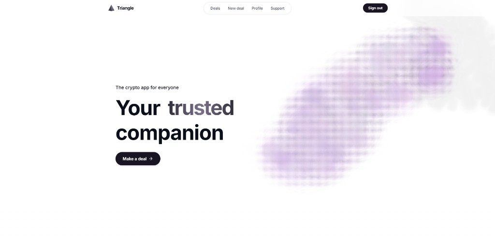
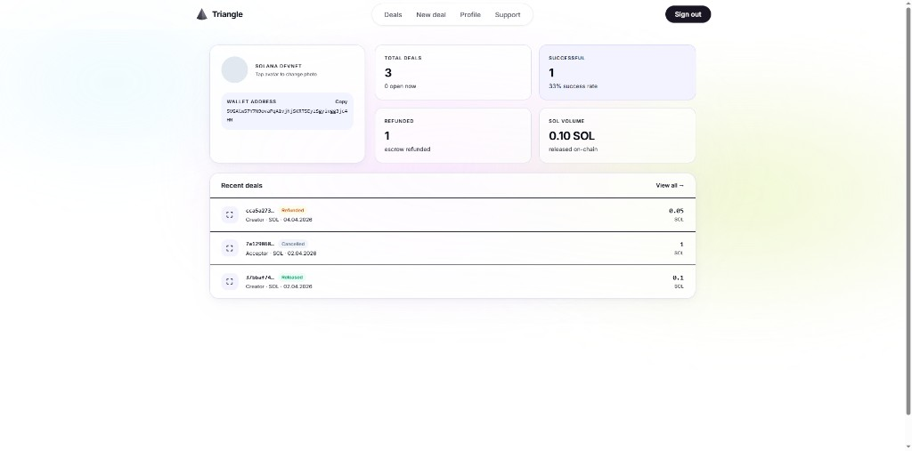
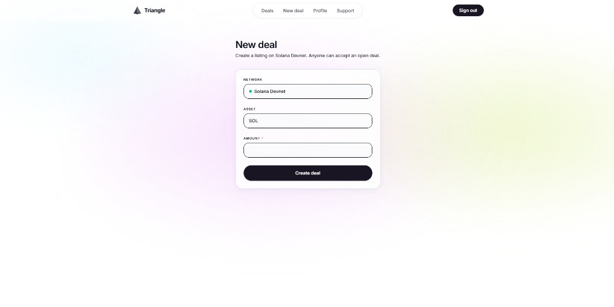

<div align="center">

# Triangle

**Simple escrow** – fast and convenient transactions designed for widespread use

**Secured escrow (backed by real assets)** – high-value transactions with guaranteed fulfillment using deposits in the form of real assets

[](LICENSE)
[](https://solana.com/)
[](https://www.anchor-lang.com/)

[](https://github.com/notbelieved/Triangle/actions/workflows/ci.yml)

**Repository:** [github.com/notbelieved/Triangle](https://github.com/notbelieved/Triangle)  

</div>

---

## Quick links

| | |
|---|---|
| **Solana program** | [`solana-program/README.md`](solana-program/README.md) |
| **Documentation** | [`docs/README.md`](docs/README.md) — architecture, API, roadmap |
| **Source** | [github.com/notbelieved/Triangle](https://github.com/notbelieved/Triangle) |

---

## Problem & Solution
Problem

P2P/OTC transactions already happen in Telegram and local communities (e.g. freelance and service marketplaces), but the current infrastructure fails to solve real user problems:

1) users have to manually search for third-party escrow agents
2) escrow providers charge fees even if the deal is not completed
3) popular platforms have high fees → users try to bypass them
4) there is no simple way to link off-chain actions (payments, service delivery) with on-chain execution
5) existing solutions have high UX friction and require switching between multiple services

as a result, transactions are either unsafe or inconvenient and expensive

---
Solution

We are building an execution layer for P2P transactions on Solana, designed to fit into existing user workflows and remove unnecessary complexity.

1) UX via Solana Actions/Blinks — transactions without switching between apps or complex dApps
2) Simple escrow - fast transactions with minimal friction
3) Escrow with RWA collateral — optional layer to secure obligations in more complex deals
4) RWA layer - connects off-chain actions with on-chain execution
5) AML layer - basic fund verification

RWA is used as an optional collateral layer.
At the current stage, the RWA market still has limited liquidity,
so we implement it as an optional feature for future growth,
rather than making it mandatory for every transaction

We don’t replace existing platforms

We add a transaction execution layer with better UX

## Why Solana (for this product)

Solana is better suited for microtransactions and high transaction volumes than EVM-compatible chains, and its massive capacity means we don’t need to switch to other chains. We also have previous experience with Helius/Urban node for a private project and are already familiar with the Solana ecosystem.

We will also have a mechanism involving different addresses, i.e., accounts.
And this cannot be implemented on Ethereum
(since funds spent on deploying a proxy contract cannot be refunded).

---

## Features

- Privy auth (Easy sign-in for Web2/Web3 users), Solana wallet linking, deal lifecycle (create → accept → escrow → fund → confirm)
- Anchor escrow: `init_escrow`, `deposit`, `buyer_release`, authority `release` / `refund_to`, `set_frozen`
- PostgreSQL API (`server/`) + React SPA (`web/`)
- Support panel: program `initialize`, freeze / release / refund, on-chain + RPC status

---

## Demo & screenshots

| Landing | Profile & deals | New deal |
|:---:|:---:|:---:|
|  |  |  |

Screenshots live in [`docs/assets/`](docs/assets/). When you ship a public deployment, add the demo URL to Quick links.

---

## Tech stack

| Layer | Stack |
|-------|--------|
| On-chain | [Anchor](https://www.anchor-lang.com/) 0.30.x, Rust, Solana BPF |
| API | Node.js, Express, PostgreSQL, `@solana/web3.js`, Privy server SDK |
| Web | React 19, Vite, React Router, Privy React, Tailwind CSS v4 |

---

## Repository layout

```
Triangle/
├── solana-program/     # Anchor crate + deploy notes
├── server/             # REST API, escrow orchestration
├── web/                # Frontend SPA
├── docs/               # architecture, api, roadmap
└── .github/workflows/  # CI (lint + build)
```

---

## Quickstart (local)

### 1. Database

```bash
# Create DB (example)
createdb triangle
cp server/env.example.txt server/.env
# Edit server/.env — DATABASE_URL, PRIVY_*, TRIANGLE_ESCROW_PROGRAM_ID, SOLANA_*, etc.
cd server && npm ci && npm run db:setup
```

### 2. API

```bash
cd server && npm run dev
# default http://localhost:3001
```

### 3. Web

```bash
cd web && npm ci && npm run dev
# configure API proxy / env as in your Vite setup
```

### 4. Solana program

See [`solana-program/README.md`](solana-program/README.md) — `anchor build`, deploy to **devnet**, set `TRIANGLE_ESCROW_PROGRAM_ID`, then **once** call support **Initialize program** (or `POST /api/support/program/initialize`) so the `config` PDA exists.

**Never commit** real `.env` files or private keys. Use `server/env.example.txt` as a template.

---

## Environment

Copy `server/env.example.txt` → `server/.env` and fill:

- `PRIVY_APP_ID`, `PRIVY_APP_SECRET`
- `DATABASE_URL`
- `TRIANGLE_ESCROW_PROGRAM_ID`
- `SOLANA_RPC_URL` (devnet for development)
- `SOLANA_AUTHORITY_PRIVATE_KEY` (base58 secret for support txs — fund on devnet)
- Optional: `SUPPORT_API_SECRET` if your deployment uses it

---

## Team

| Role | Name | Links |
|------|------|-------|
| CTO | notbelieved | [Telegram](https://t.me/evadecompanion) |
| CEO | sleep | [Telegram](https://t.me/accursing) |

---

## Roadmap

- [x] Core escrow + support freeze / refund / release
- [ ] RWA Core escrow + public demo deployment
- [ ] A new dispute resolution system based on decentralization and rewards

---

## Security

Do not commit secrets. See [SECURITY.md](SECURITY.md).

## License

[MIT](LICENSE)

---

## GitHub Topics (suggested)

`solana` · `anchor` · `escrow` · `defi` · `react` · `vite` · `nodejs`

_Set these in the repo **About** settings if you want._
