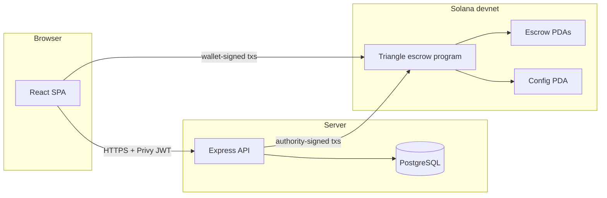

# Architecture

**How the product is built** — system context, components, and data flows.

## System context

## Components

| Part | Responsibility |
|------|----------------|
| **`web/`** | UI: deals, escrow creation/funding, Privy + Solana wallet, support screens. |
| **`server/`** | Auth (Privy), deal CRUD, unsigned tx building for users, **support** routes that sign with `SOLANA_AUTHORITY_PRIVATE_KEY`, escrow sync. |
| **`solana-program/`** | Anchor program: global `config` (authority), per-deal escrow PDA, deposit, release, refund when frozen, buyer release. |

## Environment boundaries

- **User transactions** are signed in the browser (creator / seller).
- **Support** (initialize `config`, freeze, authority release/refund) is signed on the server — the key must match on-chain `config.authority` after `initialize`.

## Escrow data flow

1. Escrow PDA is derived from program id + deal UUID bytes (`server/escrowProgram.js` — must match Anchor seeds).
2. Users sign `init_escrow` / `deposit` (and related) in the wallet.
3. `POST .../escrow/sync` reads chain state and updates the database.

## Code map

- On-chain logic: `solana-program/programs/triangle_escrow/src/lib.rs`
- Instruction builders: `server/escrowProgram.js`

## See also

- [api.md](api.md) — HTTP API  
- [roadmap.md](roadmap.md) — planned work  
